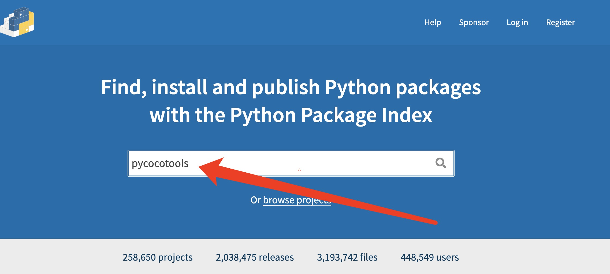
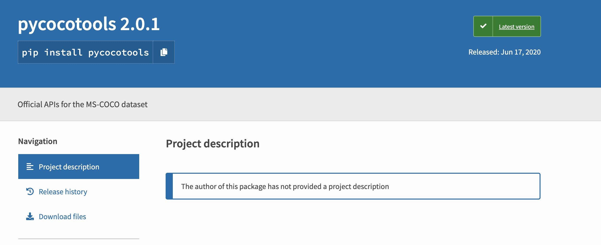
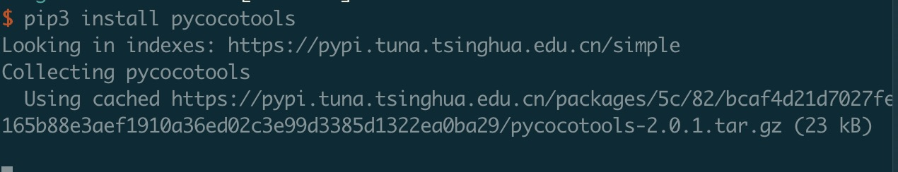
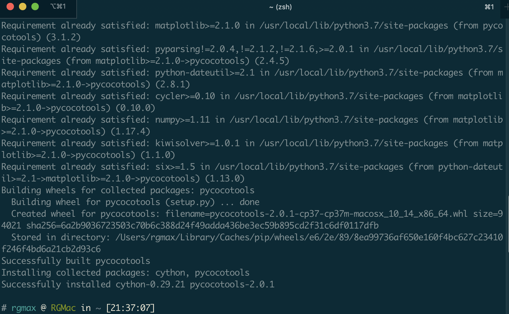

## 安装COCO API

### 直接pip安装

浏览了网上大部分的文章、博客，发现关于COCO API的安装方法，都是先去官方git仓库clone到本地，然后进入目标路径进行编译。

考虑到官方git仓库提供了Matlab, Python 和 Lua三种语言的api，而我只需要用py，既然是python，那么当然首先考虑能不能用pip安装呀，毕竟pip管理起来比较方便。



那么就去[PyPi](https://pypi.org/)搜索一下,看看有没有这个api对应的库。哦对了，COCO API对应import的时候的库名为 pycocotools



诶，发现有哦～

那么就简单了

```python
 pip3 install pycocotools
```



即使是清华源，好像还是有点小慢。，。



好在过了一会儿，安装好了

